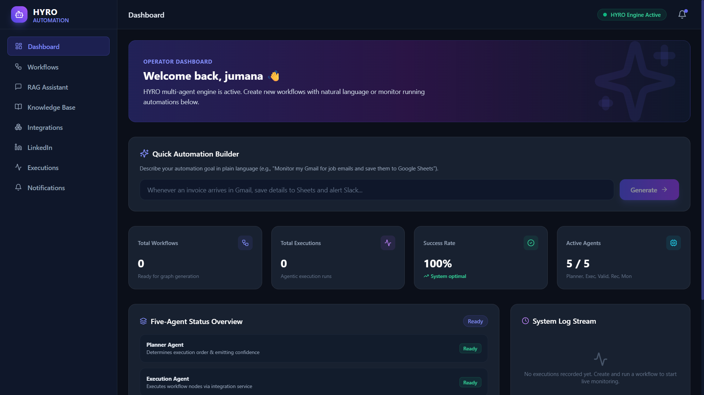
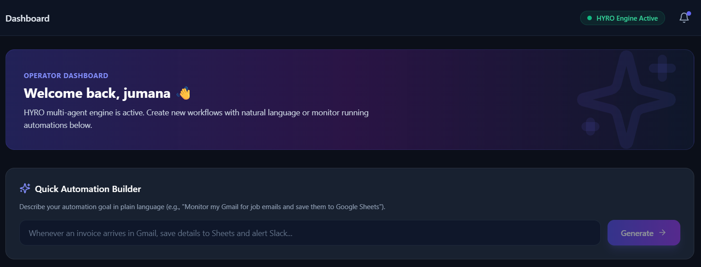
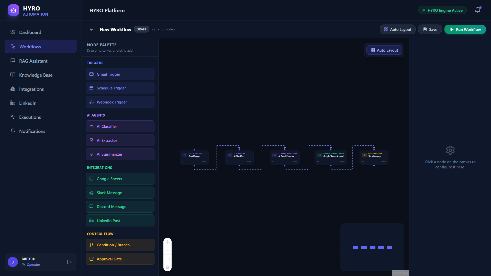
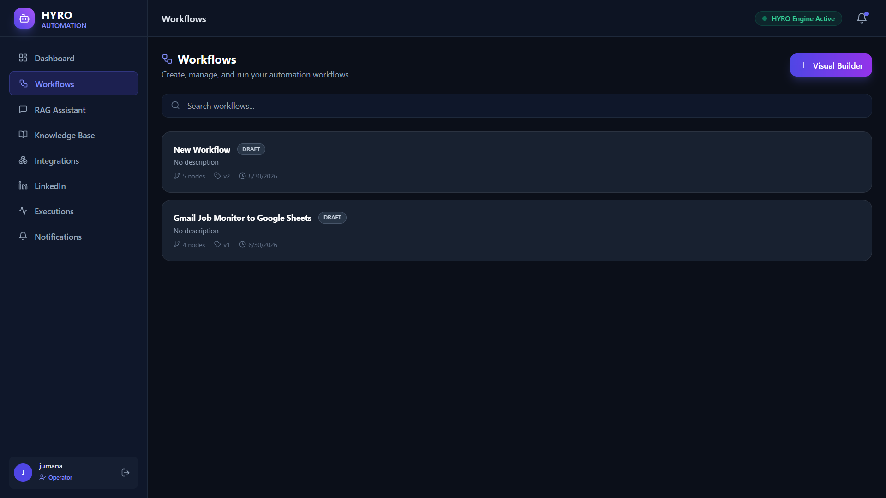
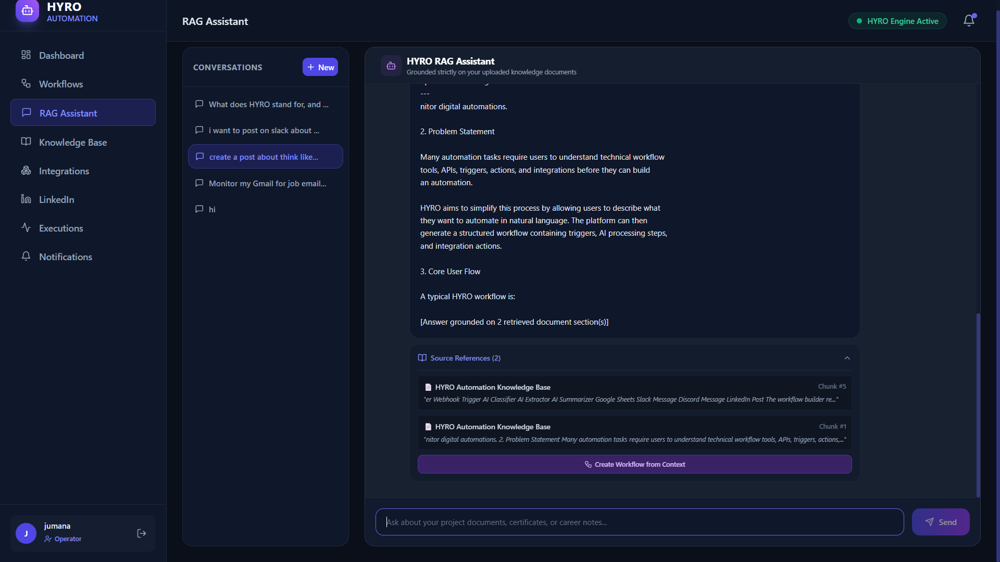
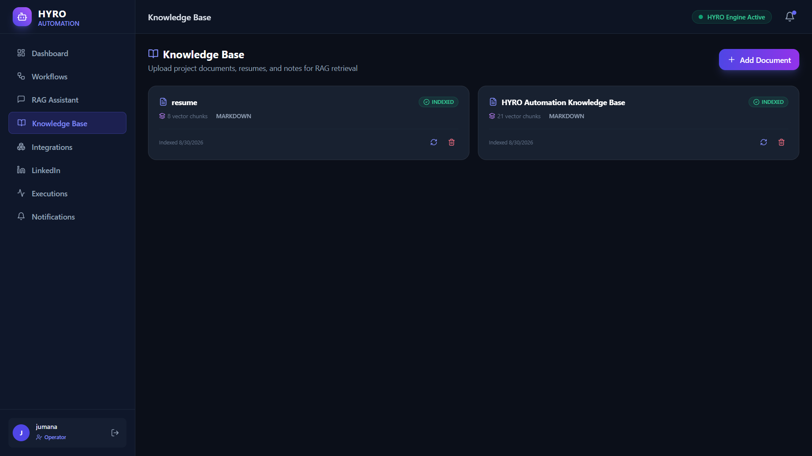
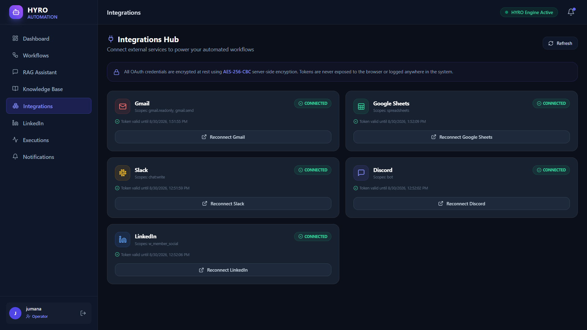
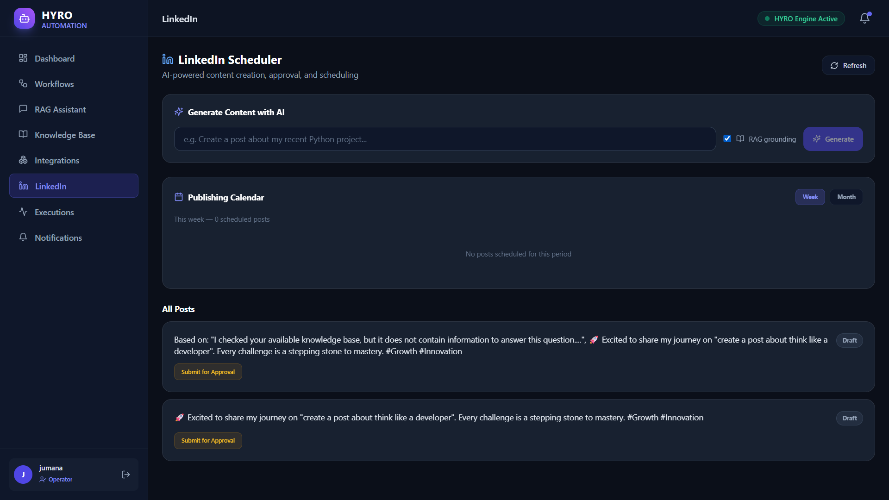
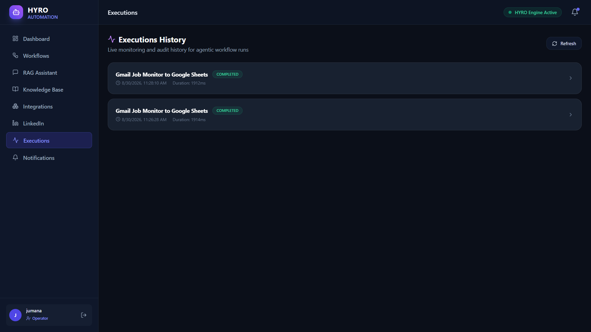
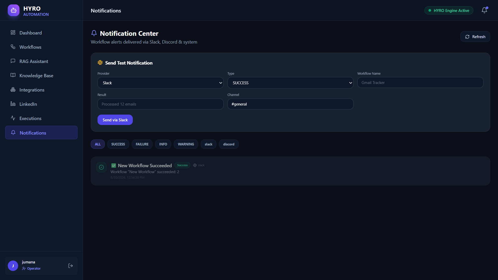

## 1. Project Name
### HYRO Automation

> **AI-powered Agentic Workflow Automation Platform**
>
>HYRO Automation is an AI-powered agentic workflow automation platform designed to reduce manual and repetitive work by allowing users to create, execute, monitor, and schedule automation workflows from a single platform.
>Build, run, and monitor end-to-end automation workflows using natural language — powered by AI planning, real Gmail, real Google Sheets, LinkedIn, Slack, and more.

---

## 2. Problem Statement

Modern automation often involves **highly manual and fragmented processes**. Users may have to manually identify repetitive tasks, understand and configure triggers and actions, design workflows step by step, connect each external service individually, manage data across different platforms, and repeatedly monitor whether each workflow has executed successfully. When workflows become more complex, users also need to manually handle failures, validate outputs, track execution history, and recover interrupted processes.

Similarly, maintaining regular social-media activity can require users to manually prepare content in advance, remember publishing dates, and repeatedly return to the platform to publish posts on time. Managing information from documents and converting that information into actionable workflows can also require additional manual effort.

These fragmented and repetitive processes consume significant time, increase the possibility of human error, and make automation difficult to manage efficiently at scale.

---


## 3.✨ Features

| Feature | Description |
|---|---|
| **AI Workflow Builder** | Describe a workflow in plain English → AI generates the full node graph |
| **Real Gmail Integration** | OAuth2 → read, classify, and extract from real Gmail emails |
| **Real Google Sheets** | Append extracted job data as real rows into your Google Spreadsheet |
| **LinkedIn Scheduler** | Draft and schedule LinkedIn posts with a visual content calendar |
| **AI Chat (RAG)** | Ask questions about your workflow history, knowledge base |
| **Execution Engine** | Sequential node execution with retry, approval gates, and monitoring |
| **Real-time Updates** | Socket.IO live execution status updates |
| **Notifications** | In-app notification center for execution events |

### Quick Automation Builder

- Allows users to enter automation requirements using natural language.
- Automatically generates a workflow from the user's query.
- Redirects the user to the Workflow Builder after generation.
- Allows users to review the generated workflow.
- Allows users to execute the generated workflow.

### Multi-Agent Automation System

HYRO Automation includes five specialized agents:

- **Planner Agent** — Plans the workflow execution.
- **Execution Agent** — Executes workflow nodes and actions.
- **Validation Agent** — Validates workflow outputs.
- **Recovery Agent** — Handles workflow failures and recovery.
- **Monitoring Agent** — Monitors workflow execution and events.

### Visual Workflow Builder

- Visual node-based workflow builder.
- Create workflows manually.
- View existing workflows.
- Edit workflows.
- Delete workflows.
- Connect workflow nodes.
- Customize AI-generated workflows.
- Execute configured workflows.

### RAG Assistant & Knowledge Base

- Import documents and content into the Knowledge Base.
- Process and index uploaded content.
- Ask questions related to stored knowledge.
- Generate responses with source references.
- Use knowledge-base information as workflow context.
- Create workflows directly from relevant context.
- Generate workflows from retrieved context.
- Execute workflows generated from knowledge context.

### Integrations

HYRO Automation supports integrations with:

- Gmail
- Google Sheets
- Slack
- Discord
- LinkedIn

These integrations allow workflows to interact with external services.

### Workflow Execution & History

- Execute automation workflows.
- Sequential workflow execution.
- Retry support.
- Approval gates.
- Execution monitoring.
- Execution history.
- Workflow execution status.
- Execution duration and status tracking.

### LinkedIn Scheduler

- AI-powered content creation.
- Create and save LinkedIn post drafts.
- Approval-based content workflow.
- Visual content calendar.
- Schedule posts for future dates.
- Prepare posts weeks or months in advance.
- Publish content according to configured schedules.

### Notifications

- Workflow execution alerts.
- System notifications.
- Slack notifications.
- Discord notifications.
- Execution event notifications.
- Notification history.
- Read/unread notification status.

### Real-time Updates

- Live workflow execution status updates.
- Socket.IO-based real-time communication.
- Real-time execution event updates.

---

## 4.🛠️ Tech Stack

### Frontend (client/)
- **Next.js 14** — React framework with SSR/SSG
- **Tailwind CSS** — utility-first styling
- **Zustand** — lightweight state management
- **React Flow (@xyflow/react)** — interactive workflow canvas
- **Axios** — HTTP client
- **Socket.IO Client** — real-time updates

### Backend (server/)
- **Express.js** — REST API server
- **MongoDB + Mongoose** — data persistence
- **JWT** — authentication
- **AES-256 encryption** — secure OAuth token storage
- **Socket.IO** — real-time event broadcasting
- **OpenRouter / Gemini AI** — workflow AI planning

### AI

- OpenRouter
- Gemini
- AI Workflow Generation
- AI Agents
- Retrieval-Augmented Generation (RAG) 

### Integrations

- Gmail API
- Google Sheets API
- LinkedIn API
- Slack
- Discord
- OAuth 2.0

### Infrastructure
| Service | Provider |
|---|---|
| Version controller | **Git** |
| Source code repository | **GitHub** |
| Frontend | **Vercel** (free tier) |
| Backend API | **Render** (free tier) |
| Database | **MongoDB Atlas** (free M0 cluster) |

---
## 📁 Project Structure

```text
hyro_automation/                    ← Monorepo root
│
├── client/                         ← FRONTEND (Next.js 14 — deployed on Vercel)
│   ├── src/
│   │   ├── pages/                  ← Next.js pages (routes)
│   │   │   ├── index.jsx           ← Landing page
│   │   │   ├── dashboard.jsx       ← Dashboard
│   │   │   ├── workflows/
│   │   │   │   ├── builder.jsx     ← AI Workflow Builder canvas
│   │   │   │   └── [id].jsx        ← Individual workflow editor
│   │   │   ├── integrations.jsx    ← OAuth integrations manager
│   │   │   ├── executions/
│   │   │   │   ├── index.jsx       ← Execution history list
│   │   │   │   └── [id].jsx        ← Execution detail & logs
│   │   │   ├── linkedin.jsx        ← LinkedIn post scheduler
│   │   │   ├── chat.jsx            ← AI Chat assistant (RAG)
│   │   │   ├── knowledge.jsx       ← Knowledge base manager
│   │   │   ├── notifications.jsx   ← Notification center
│   │   │   ├── login.jsx            ← Login
│   │   │   └── register.jsx        ← Register
│   │   ├── components/             ← Reusable React components
│   │   ├── store/                  ← Zustand state management
│   │   ├── services/               ← API client (Axios)
│   │   └── styles/                 ← Global CSS / Tailwind
│   ├── .env.local.example          ← Frontend environment template
│   ├── next.config.js              ← Next.js configuration
│   ├── tailwind.config.js
│   └── package.json
│
├── server/                         ← BACKEND (Express.js — deployed on Render)
│   ├── src/
│   │   ├── server.js               ← Entry point
│   │   ├── app.js                  ← Express app setup
│   │   ├── config/
│   │   │   ├── db.js               ← MongoDB Atlas connection
│   │   │   └── env.js              ← Environment variable loader
│   │   ├── routes/                 ← API route definitions
│   │   │   ├── authRoutes.js
│   │   │   ├── workflowRoutes.js
│   │   │   ├── executionRoutes.js
│   │   │   ├── integrationRoutes.js
│   │   │   ├── linkedinRoutes.js
│   │   │   ├── gmailRoutes.js
│   │   │   ├── chatRoutes.js
│   │   │   ├── knowledgeRoutes.js
│   │   │   ├── notificationRoutes.js
│   │   │   └── healthRoutes.js
│   │   ├── controllers/            ← Request handlers
│   │   ├── models/                 ← Mongoose MongoDB schemas
│   │   ├── agents/                 ← AI Agentic execution system
│   │   │   ├── orchestrator.js     ← Execution lifecycle manager
│   │   │   ├── executionAgent.js   ← Node executor
│   │   │   ├── plannerAgent.js     ← Workflow planning
│   │   │   ├── validationAgent.js  ← Output validation
│   │   │   ├── recoveryAgent.js    ← Retry & error recovery
│   │   │   └── monitoringAgent.js  ← Execution monitoring
│   │   ├── integrations/           ← OAuth integration connectors
│   │   │   ├── gmailIntegration.js
│   │   │   ├── googleSheetsIntegration.js
│   │   │   ├── linkedinIntegration.js
│   │   │   ├── slackIntegration.js
│   │   │   └── discordIntegration.js
│   │   ├── services/               ← Business logic services
│   │   └── middleware/             ← Authentication & error handling
│   ├── tests/                      ← Automated test suites
│   ├── .env.example                ← Backend environment template
│   └── package.json
│
├── Screenshots/                    ← APPLICATION SCREENSHOTS
│   ├── dashboard.png               ← Dashboard
│   ├── quick-automation-builder.png← Quick Automation Builder
│   ├── generated-workflow.png      ← AI Generated Workflow
│   ├── workflow-builder.png        ← Visual Workflow Builder
│   ├── rag-assistant.png            ← RAG Assistant
│   ├── knowledge-base.png           ← Knowledge Base
│   ├── integrations.png             ← Integrations
│   ├── linkedin.png                 ← LinkedIn Scheduler
│   ├── executions.png               ← Execution History
│   └── notifications.png            ← Notifications
│
├── .gitignore                      ← Ignores node_modules, .env files
├── HYRO_Automation_SDD.md           ← Software Design Document
├── HYRO_Automation_Testing.md       ← Testing documentation
├── HYRO_Google_Sheets_Real_Result_Fix.md
├── package-lock.json
├── package.json                     ← Root monorepo scripts
├── README.md                        ← Project documentation
├── render.yaml                      ← Render deployment configuration
└── vercel.json                      ← Vercel deployment configuration
```
---

#**# 5. Screenshots**

Screenshots of the major application screens and important features are provided below.

### 🏠 Dashboard

The central operator dashboard provides an overview of the HYRO Automation platform, active agents, workflows, executions, and the Quick Automation Builder.

<p align="center">
  
</p>

---

### ⚡ Quick Automation Builder

Users can describe their automation requirements in natural language. HYRO automatically generates the corresponding workflow and redirects the user to the visual workflow builder for review and execution.

<p align="center">
  
</p>

---

### 🤖 AI Generated Workflow

The AI Workflow Builder converts a natural-language automation request into a structured visual workflow containing triggers, AI agents, and integration nodes.

<p align="center">
  
</p>

---

### 🔗 Visual Workflow Builder

The visual workflow builder allows users to create, edit, connect, customize, and execute automation workflows using a node-based interface.

<p align="center">
  
</p>

---

### 🧠 RAG Assistant

The RAG Assistant allows users to interact with their uploaded project knowledge and receive knowledge-grounded responses with source references.

<p align="center">
  
</p>

---

### 📚 Knowledge Base

Users can upload and index project documents and other relevant content for retrieval-augmented generation and workflow creation from knowledge context.

<p align="center">
  
</p>

---

### 🔌 Integrations

HYRO Automation provides a centralized integration manager for connecting external services such as Gmail, Google Sheets, Slack, Discord, and LinkedIn through OAuth-based authentication.

<p align="center">
  
</p>

---

### 💼 LinkedIn Scheduler

The LinkedIn module provides AI-powered content creation, draft management, approval workflows, and scheduled publishing through a visual content calendar.

<p align="center">
  
</p>

---

### 📊 Execution History

The Execution History page provides visibility into workflow runs, execution status, duration, and automation activity.

<p align="center">
  
</p>

---

### 🔔 Notifications

The Notification Center provides system and workflow execution alerts, including Slack and Discord notification support.

<p align="center">
  
</p>

---
> Screenshots demonstrate the major application screens and core functionality of HYRO Automation.

---

## 6. Live Demo

### Frontend Application

**Vercel Deployment:**

https://hyro-automation.vercel.app

The HYRO Automation frontend is deployed and accessible online through Vercel.

---

## 7. Backend

### Backend API

**Render Deployment:**

https://hyro-automation.onrender.com

### Backend Health Check

https://hyro-automation.onrender.com/api/health

The HYRO Automation backend is deployed on Render and provides the REST API required by the frontend.

The backend is connected to the production MongoDB Atlas database.


## 8.🚀 Setup Instructions (Local Development)

### Prerequisites
- Node.js v18+
- MongoDB running locally (or MongoDB Atlas URI)

### 1. Clone the repository
```bash
git clone https://github.com/Jumanaafra/hyro_automation.git
cd hyro_automation
```

### 2. Install all dependencies
```bash
npm run install:all
```

### 3. Configure environment variables

**Backend** — copy and fill in:
```bash
cp server/.env.example server/.env
```

**Frontend** — copy and fill in:
```bash
cp client/.env.local.example client/.env.local
```

### 4. Start development servers
```bash
npm run dev
```

- Frontend: http://localhost:3000
- Backend API: http://localhost:5000/api

---

## 🌐 Deployment (Vercel + Render + MongoDB Atlas)

See the full step-by-step guide below ↓

---

## 9.📋 Environment Variables

### Backend (`server/.env`)

| Variable | Required | Description |
|---|---|---|
| `PORT` | ✅ | API port (5000 locally, set by Render in production) |
| `NODE_ENV` | ✅ | `development` or `production` |
| `MONGODB_URI` | ✅ | MongoDB Atlas connection string |
| `JWT_SECRET` | ✅ | Long random string for JWT signing |
| `CREDENTIAL_ENCRYPTION_KEY` | ✅ | 64-hex-char AES-256 key for OAuth token encryption |
| `CLIENT_URL` | ✅ | Frontend URL for CORS (e.g. `https://your-app.vercel.app`) |
| `OPENROUTER_API_KEY` | optional | AI workflow generation (falls back to deterministic) |
| `GEMINI_API_KEY` | optional | Alternative AI provider |
| `GMAIL_CLIENT_ID` | optional | Google OAuth for Gmail integration |
| `GMAIL_CLIENT_SECRET` | optional | Google OAuth for Gmail integration |
| `GOOGLE_SHEETS_CLIENT_ID` | optional | Google OAuth for Sheets integration |
| `GOOGLE_SHEETS_CLIENT_SECRET` | optional | Google OAuth for Sheets integration |
| `LINKEDIN_CLIENT_ID` | optional | LinkedIn OAuth for posting |
| `LINKEDIN_CLIENT_SECRET` | optional | LinkedIn OAuth for posting |

### Frontend (`client/.env.local`)

| Variable | Required | Description |
|---|---|---|
| `NEXT_PUBLIC_API_URL` | ✅ | Backend API URL (e.g. `https://your-api.onrender.com/api`) |
| `NEXT_PUBLIC_SOCKET_URL` | ✅ | Backend WebSocket URL (e.g. `https://your-api.onrender.com`) |

---

## 📡 API Reference

| Method | Endpoint | Description |
|---|---|---|
| `GET` | `/api/health` | Health check |
| `POST` | `/api/auth/register` | Register user |
| `POST` | `/api/auth/login` | Login user |
| `GET` | `/api/workflows` | List workflows |
| `POST` | `/api/workflows` | Create workflow |
| `POST` | `/api/workflows/generate` | AI generate workflow from prompt |
| `POST` | `/api/workflows/:id/execute` | Execute workflow |
| `GET` | `/api/executions` | List executions |
| `GET` | `/api/executions/:id` | Get execution detail |
| `GET` | `/api/integrations` | List connected integrations |
| `GET` | `/api/integrations/oauth/:provider/start` | Start OAuth flow |
| `POST` | `/api/chat` | AI Chat (RAG) |
| `GET` | `/api/linkedin/posts` | List LinkedIn posts |

---

## 🔒 Security

- OAuth tokens encrypted at rest with **AES-256-GCM**
- JWT-protected API routes
- Secrets never exposed to the browser
- `.env` files excluded from Git via `.gitignore`
- Helmet.js security headers enabled

---

## 📄 License

MIT © 2026 HYRO Automation
